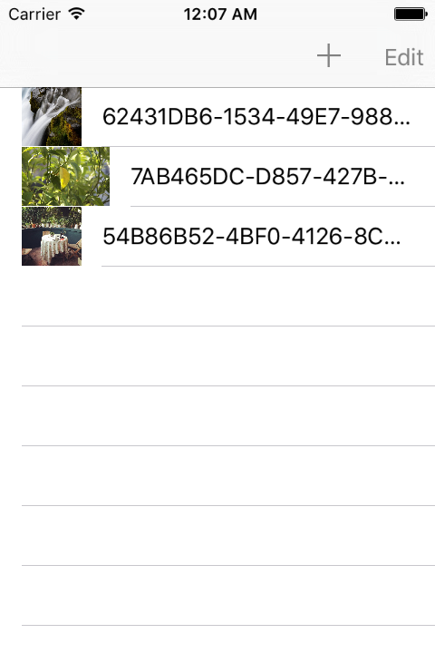

# sqlite4image
SQLite3 for Image items in Objective-C for iOS

# SQLite4Image

Screenshot.

## Supported OS
Tested in iOS 6.x, 7.x, 8.x, 9.x device and simulator

## LICENSE
Released in [MIT License](http://opensource.org/licenses/mit-license.php)
